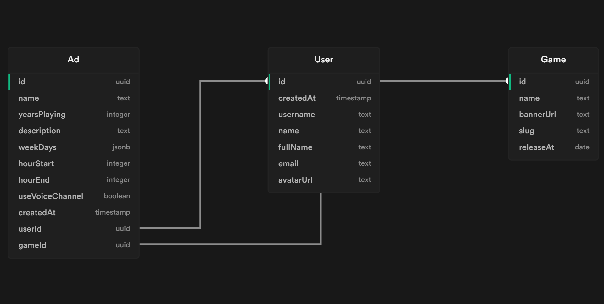

<h1 align="center">
    
</h1>

<h4 align="center"> 
	:heavy_check_mark:  Next Level Week eSports 🎮🚀 Done! :heavy_check_mark:
</h4>
<p align="center">
  

<a href="https://www.linkedin.com/in/fellipeutaka/">
    
  </a>

<a aria-label="Completed" href="https://lp.rocketseat.com.br/nlw">
    </img>
  </a>

<a href="https://github.com/fellipeutaka/nlw-esports/commits/supabase">
    
  </a>


   <a href="https://github.com/fellipeutaka/nlw-esports/stargazers">
    
  </a>
</p>
<p align="center">
  <a href="#-nlw">Next Level Week</a>   |   
  <a href="#-project">Project</a>   |   
  <a href="#rocket-Technologies">Technologies</a>   |   
  <a href="#-layout">Layout</a>   |   
  <a href="#-how-to-use">How to use</a>   |   
  <a href="#-how-to-contribute">How to contribute</a>   |   
  <a href="#memo-license">License</a>   |   
  <a href="https://nlw-esports-supabase.vercel.app/">Live demo</a>
</p>

## ℹ️ What's Next Level Week?

NLW is a practical week with lots of code, challenges, networking and a single objective: to take you to the next level.
Through our method you will learn new tools, learn about new technologies and discover hacks that will boost your career.
An online and completely free event that will help you take the next step in your evolution as a dev.

### Stages

- Stage 1: Base Building - ✔️
  - Starting and configuring the development environment with Node, React and React Native.
- Stage 2: High speed - ✔️
  - Building the web and mobile interface.
- Stage 3: To be continued - ✔️
  - Building the back-end.
- Stage 4: Power Up - ✔️
  - Consuming backend's API RESTFul on Web and Mobile app.
- Stage 5: Final Round - ✔️
  - Creating ads and connecting to other people in mobile.

## 💻 Project

Find Your Duo is a web and mobile platform that helps gamers find a partner to play their favorite game online, connected to Twitch API.

<h1 align="center">
    
</h1>
<h1 align="center">
    
</h1>

## 🚀 Technologies

This project was developed with the following technologies:

- [TypeScript][ts]
- [Node.js][node]
- [Supabase][supabase]
- [MongoDB][mongodb]
- [React][react]
- [Next.js][next]
- [TailwindCSS][tailwind]
- [React Native][rn]
- [Expo][expo]
- [styled-components][styled-components]

## 🔖 Layout

To access the layout use [Figma][figma].

## ℹ️ How To Use

To clone and run this application, you'll need [Git](https://git-scm.com), [Node.js][node] + [Yarn][yarn] installed on your computer.
Also, you'll need to create a [Supabase project](supabase).

### Create Supabase tables

```sql
create table User (
  id uuid default uuid_generate_v4() primary key,
  createdAt timestamp default now() not null,
  username text not null,
  name text not null,
  fullName text not null,
  email text not null,
  avatarUrl text not null
);

create table Game (
  id uuid default uuid_generate_v4() primary key,
  name text not null,
  bannerUrl text not null,
  slug text not null,
  releaseAt date default now()
);

create table Ad (
  id uuid default uuid_generate_v4() primary key,
  name text not null,
  yearsPlaying integer not null,
  description text not null,
  weekDays jsonb not null,
  hourStart integer not null,
  hourEnd integer not null,
  useVoiceChannel boolean not null,
  createdAt timestamp default now() not null,
  userId uuid references User (id),
  gameId uuid references Game (id)
);
```

### Insert game data

```csv
id,name,bannerUrl,slug,releaseAt
684c9e5b-b430-4f53-91df-509081cda6fc,Teamfight Tactics,https://static-cdn.jtvnw.net/ttv-boxart/513143-{width}x{height}.jpg,teamfight-tactics,2019-06-26
69e1baa6-cec2-4749-9088-b6315443e699,Rocket League,https://static-cdn.jtvnw.net/ttv-boxart/30921-{width}x{height}.jpg,rocket-league,2015-07-07
0324b270-9504-43f6-9e4b-99645f58be49,Overwatch 2,https://static-cdn.jtvnw.net/ttv-boxart/515025_IGDB-{width}x{height}.jpg,overwatch-2,2022-10-04
9d5d8c3f-885d-4abd-adbe-29308e421166,Fall Guys,https://static-cdn.jtvnw.net/ttv-boxart/512980-{width}x{height}.jpg,fall-guys,2020-08-04
0f4917fd-09e8-4cdc-9300-4085916a311e,Tom Clancy's Rainbow Six Siege,https://static-cdn.jtvnw.net/ttv-boxart/460630_IGDB-{width}x{height}.jpg,r6,2015-12-01
86e535ae-226b-44c1-ab81-e24063db5c86,Among Us,https://static-cdn.jtvnw.net/ttv-boxart/510218_IGDB-{width}x{height}.jpg,among-us,2018-06-15
d00754bc-4d38-4512-bc67-7d1b0d82f85f,Roblox,https://static-cdn.jtvnw.net/ttv-boxart/23020_IGDB-{width}x{height}.jpg,roblox,2006-09-01
9edd444b-8c08-4137-8f51-de7a5bb5a3cd,Free Fire,https://static-cdn.jtvnw.net/ttv-boxart/502732_IGDB-{width}x{height}.jpg,jogo-de-corno,2017-12-04
685fd8f9-d5dd-48e0-8e33-f424865236e6,Phasmophobia,https://static-cdn.jtvnw.net/ttv-boxart/518184_IGDB-{width}x{height}.jpg,phasmophobia,2020-09-18
81d499f9-88c7-46a2-8bfe-9ef75c6eab78,FIFA 23,https://static-cdn.jtvnw.net/ttv-boxart/1745202732_IGDB-{width}x{height}.jpg,fifa-23,2022-09-27
d4ae0ec3-001a-4295-93e8-a610cd009aa8,VALORANT,https://static-cdn.jtvnw.net/ttv-boxart/516575-{width}x{height}.jpg,valorant,2020-07-02
3d420193-5e82-4b91-a0b4-4086a74e60bd,League of Legends,https://static-cdn.jtvnw.net/ttv-boxart/21779-{width}x{height}.jpg,lol,2009-10-27
a4504a6d-31a3-4c12-93a3-8deaab97c679,Grand Theft Auto V,https://static-cdn.jtvnw.net/ttv-boxart/32982_IGDB-{width}x{height}.jpg,gta-v,2013-09-17
4715f2aa-4aed-4331-8941-38dda7fcedbe,Minecraft,https://static-cdn.jtvnw.net/ttv-boxart/27471_IGDB-{width}x{height}.jpg,minecraft,2011-11-18
b7974544-7d2d-4cbe-ada0-49b08695a78f,Dota 2,https://static-cdn.jtvnw.net/ttv-boxart/29595-{width}x{height}.jpg,dota-2,2013-07-09
e0588364-5200-4979-a491-336cccaf1a36,Counter-Strike: Global Offensive,https://static-cdn.jtvnw.net/ttv-boxart/32399_IGDB-{width}x{height}.jpg,csgo,2012-08-21
666585c6-f124-4bfd-8cea-bfdec361a766,Call of Duty: Modern Warfare II,https://static-cdn.jtvnw.net/ttv-boxart/1678052513_IGDB-{width}x{height}.jpg,cod-mw-2,2022-10-28
859a23dd-f172-4017-8433-97d82cc7da24,World of Warcraft,https://static-cdn.jtvnw.net/ttv-boxart/18122-{width}x{height}.jpg,world-of-warcraft,2004-11-23
b7a77528-2add-4416-8e30-70f4985370ca,Apex Legends,https://static-cdn.jtvnw.net/ttv-boxart/511224-{width}x{height}.jpg,apex-legends,2019-02-04
82d21df2-3cf7-433d-82b9-cf33078bcfe7,Fortnite,https://static-cdn.jtvnw.net/ttv-boxart/33214-{width}x{height}.jpg,fortnite,2017-06-21
043c9379-769c-4b17-bc41-5df4705bfd2d,VRChat,https://static-cdn.jtvnw.net/ttv-boxart/499003_IGDB-{width}x{height}.jpg,vrchat,2014-01-16
c079c06e-87c2-4bf5-b2a7-e5b4b76e20dd,Dead by Daylight,https://static-cdn.jtvnw.net/ttv-boxart/491487-{width}x{height}.jpg,dead-by-daylight,2016-06-14
146e1670-ffb7-4d02-bde4-f8c4242b1732,World of Tanks,https://static-cdn.jtvnw.net/ttv-boxart/27546-{width}x{height}.jpg,world-of-tanks,2010-08-12
```

### Create User trigger

```sql
create function public.handle_new_user()
returns trigger
language plpgsql
security definer set search_path = public
as $$
begin
  insert into public."User" (id, username, name, "fullName", email, "avatarUrl")
  values (new.id, lower(new.raw_user_meta_data->>'full_name'), new.raw_user_meta_data->>'name', new.raw_user_meta_data->>'full_name', new.raw_user_meta_data->>'email', new.raw_user_meta_data->>'avatar_url');
  return new;
end;
$$;

-- trigger the function every time a user is created
create trigger on_auth_user_created
  after insert on auth.users
  for each row execute procedure public.handle_new_user();
```

From your command line:

### Install Web App

```bash
# Clone this repository
$ git clone https://github.com/fellipeutaka/nlw-esports.git

# Navigate to directory
$ cd web

# Install dependencies
$ yarn

# Create .env.local based on the .env.example file

# Start server
$ yarn dev

# running on port 3000
```

### Install Mobile

```bash
# Clone this repository
$ git clone https://github.com/fellipeutaka/nlw-esports.git

# Navigate to directory
$ cd mobile

# Install dependencies
$ yarn

# Create .env based on the .env.example file

# Run
$ yarn dev

# Expo will open, just scan the QR Code on terminal or expo page
```

## 🤔 How to contribute

1. Fork this repository.
2. Create a branch: `git checkout -b <branch_name>`.
3. Make your changes and commit them: `git commit -m '<commit_message>'`
4. Push to original branch: `git push origin <project_name> / <local>`
5. Create the pull request.

Or, see the GitHub documentation on [how to create a pull request](https://help.github.com/en/github/collaborating-with-issues-and-pull-requests/creating-a-pull-request).

## 📝 License

This project is under the MIT license. See the [LICENSE](https://github.com/fellipeutaka/nlw-esports/blob/master/LICENSE) for details.

Made with ♥ by Fellipe Utaka 👋 [Get in touch!](https://www.linkedin.com/in/fellipeutaka/)

[figma]: https://www.figma.com/file/WNtF2d8WEh69bddiJHwYiV/NLW-eSports-(Community)?node-id=0%3A1
[node]: https://nodejs.org/
[supabase]: https://supabase.com/
[mongodb]: https://www.mongodb.com/
[ts]: https://www.typescriptlang.org/
[expo]: https://expo.dev/
[react]: https://reactjs.org
[next]: https://nextjs.org/
[tailwind]: https://tailwindcss.com/
[rn]: https://reactnative.dev/
[styled-components]: https://styled-components.com/
[yarn]: https://yarnpkg.com/
